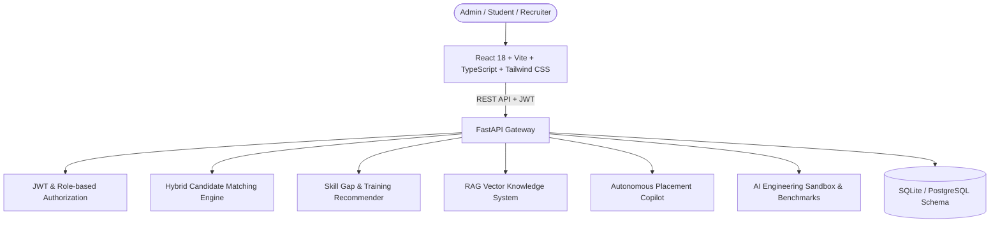

# AI Placement Command Center 

An enterprise-grade, production-quality AI-powered campus placement management and candidate-job matching platform designed for universities and corporate talent acquisition teams.

---

##  Key Capabilities & System Architecture



### 1.  Hybrid Candidate Matching & Explainable AI (XAI)
- **9-Factor Configurable Weighted Scoring Formula**:
  $$	ext{Match Score} = \sum (	ext{Weight}_i 	imes 	ext{Factor}_i)$$
  - Mandatory Drive Eligibility (Hard cutoffs for CGPA, Backlogs, Department): **20%**
  - Required Technical Skills (Direct & Semantic overlap): **30%**
  - Preferred Tools & Cloud Frameworks: **10%**
  - Practical Projects & GitHub Portfolio: **10%**
  - Industry Internships Experience: **5%**
  - Academic CGPA Score: **10%**
  - Total Technical Experience Duration: **5%**
  - Soft Skills & Communication: **5%**
  - Certifications & Credentials: **5%**
- **Explainable AI (XAI)**: Generates transparent decision rationale:
  - ✓ Matched core competencies
  - ✗ Detected critical skill gaps
  -  Project practical evidence
  -  Actionable placement officer recommendation

### 2.  Resume Intelligence & JD Analyzer
- Automatically extracts text from PDF, DOCX, and TXT files.
- Maps skill variations to standard canonical entities (e.g. `React.js`, `reactjs`, `React JS` $	o$ `React`; `spring-boot`, `springboot` $	o$ `Spring Boot`).
- Extracts CGPA, contact details, projects, and work experience.

### 3.  Skill Gap Diagnostics & 4-Week Student Prep Plan
- Aggregates active company job descriptions across campus to identify critical curriculum deficits (e.g., SQL Joins, Spring Boot, DSA).
- Automatically designs personalized 4-week structured preparation roadmaps for students.

### 4.  Autonomous AI Placement Copilot
- Equipped with controlled business logic tools:
  - `rank_candidates(job_id, limit)`
  - `search_students(department, min_cgpa)`
  - `get_placement_statistics()`
  - `get_training_recommendations()`
- Strict safety: The agent calls internal backend functions; it never executes raw database queries or hallucinates candidate records.

### 5.  RAG Knowledge Retrieval System
- Chunks official placement policies, circulars, and interview guidelines with vector embeddings.
- Synthesizes grounded answers with strict source citations and zero hallucinations.

### 6.  AI Engineering & Evaluation Sandbox
- Automated evaluation harness computing **Precision@3**, **Precision@5**, extraction accuracy, and latency/cost telemetry.

---

##  Quick Start & Local Execution

### Prerequisites
- Python 3.10+ (or `uv`)
- Node.js 18+ and npm

### 1. Backend Setup
```bash
cd backend
python -m venv .venv
source .venv/bin/activate  # On Windows: .venv\Scriptsctivate
pip install -r requirements.txt
pip install email-validator

# Run database migration and seed demo data (52 students, 10 companies, 7 drives)
python -m app.db.seed_data

# Start FastAPI development server
uvicorn app.main:app --reload --port 8000
```
API Documentation: [http://localhost:8000/docs](http://localhost:8000/docs)

### 2. Frontend Setup
```bash
cd frontend
npm install
npm run dev
```
Application UI: [http://localhost:5173](http://localhost:5173)

---

##  One-Click Demo Personas

The application includes instant demo login buttons on the login screen and role-switcher pills in the sidebar:
- **Placement Officer (Admin)**: `admin@placement.edu` (Full command center, matching hub, analytics, RAG manager)
- **Candidate (Student)**: `rahul.sharma@student.edu` (Student portal, match scorecards, 4-week prep plan, resume manager)
- **Recruiter**: `recruiter@technova.com` (TechNova Solutions recruiter hub, applicant shortlists)
- **Default Password**: `password123`

---

##  Docker Deployment

```bash
docker-compose up --build
```
- Frontend: [http://localhost:3000](http://localhost:3000)
- Backend: [http://localhost:8000](http://localhost:8000)
